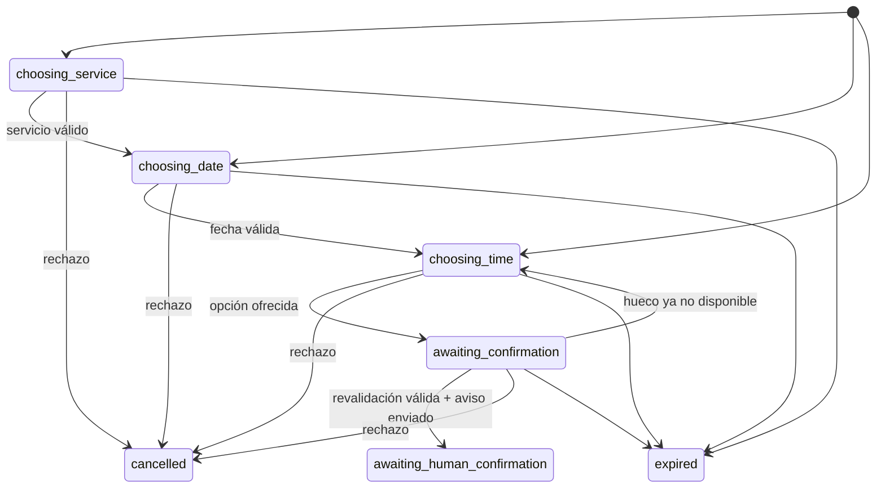

# COSTABOTS Beauty — IA controlada para WhatsApp

## Estado

Las migraciones 28–30 forman el historial de observabilidad y máquina de estados.
El orquestador desplegado utiliza esta arquitectura. La activación de IA continúa
siendo una decisión operativa mediante secreto; no se reutilizan conversaciones
históricas ni se crean citas reales.

## Principio de diseño

Gemini interpreta. El código decide. PostgreSQL recuerda.

## Coordinador único de reservas

`bookingFlow.ts` es la única ruta de reserva y `beauty_booking_sessions` es su
única fuente de verdad para servicio, fecha, profesional, opciones ofrecidas y
hora elegida. Los mensajes se conservan como historial lingüístico, pero nunca
reconstruyen ese estado.

Los resolvedores procesan primero servicio, fecha, hora, referencias de opción,
confirmación y petición humana. Gemini solo devuelve JSON estricto para aquello
que no pueda resolverse de forma determinista. No recibe herramientas de
disponibilidad ni de handoff. La disponibilidad se consulta desde `bookingFlow`
y las respuestas críticas se generan en el servidor, en texto plano.

La confirmación del cliente no crea una cita. El servidor revalida el hueco,
envía primero el aviso de confirmación humana y únicamente después cambia la
conversación a modo manual.

Gemini devuelve un JSON estricto con intención y referencias lingüísticas. No puede
elegir transiciones, escribir sesiones, invocar disponibilidad, cambiar el modo de
una conversación ni realizar handoffs. `beauty_booking_sessions` es la única fuente
de verdad del servicio, fecha, profesional, opciones ofrecidas, selección y paso.
Los mensajes se conservan como historial lingüístico, nunca para reconstruir esos
campos.

## Estados



`idle` se conserva en el enum por compatibilidad de diseño, pero el runtime no crea
sesiones vacías: la primera inserción utiliza el primer estado útil. `completed`
queda reservado para una futura cita creada o confirmada. En esta fase el máximo
estado automático es `awaiting_human_confirmation`.

## Persistencia y opciones

`offered_times` contiene objetos validados:

```json
[
  {
    "starts_at": "2026-08-03T09:00:00+02:00",
    "staff_id": "uuid",
    "label": "09:00"
  }
]
```

Las opciones son únicas, no contienen datos personales y caducan con la sesión.
`selected_starts_at` y `staff_id` deben coincidir con una opción persistida. Cambiar
servicio o fecha elimina opciones y selección anteriores.

## Flujo

1. Evolution entrega un evento firmado a `evolution-beauty-webhook`.
2. El webhook valida instancia, evento y antigüedad, y registra el evento reducido.
3. Un mensaje inbound se guarda una sola vez en `beauty_messages`.
4. Solo cuando `BEAUTY_AI_ENABLED=true`, la conversación sigue en `mode=ai` y no
   existe una persona asignada, se reserva un `beauty_ai_run`.
5. La restricción única `(inbound_message_id, operation_type)` impide que un
   inbound genere dos ejecuciones.
6. El webhook responde a Evolution sin esperar a Gemini. `EdgeRuntime.waitUntil`
   invoca después la función privada `beauty-ai-orchestrator`.
7. El orquestador reclama atómicamente la ejecución pendiente y vuelve a validar
   negocio, conversación, mensaje inbound, modo y asignación.
8. Se limita el contexto a los 12 mensajes recientes. No se envían payloads de
   Evolution, tablas completas, teléfonos, secretos ni metadatos técnicos.
9. Gemini interpreta el último inbound mediante un contrato JSON cerrado.
10. Antes de reservar y antes de enviar la respuesta se comprueba otra vez que la
    conversación continúa en `mode=ai` y sin usuario asignado.
11. La respuesta queda reservada con `client_request_id=ai-run-<run-id>`. Después
    se envía mediante Evolution y se guarda como `sender_type=ai`.
12. Los ecos outbound de esa respuesta se reconocen por `provider_message_id` y
    no vuelven a insertar el mensaje, cambiar el modo ni activar otra ejecución.

## Operaciones controladas por código

### `get_business_info`

Devuelve exclusivamente nombre comercial, dirección, teléfono público, zona
horaria, idioma y tramos semanales activos con el nombre visible del profesional.

### `list_services`

Devuelve como máximo 50 servicios activos y habilitados para reserva online:
identificador interno, nombre, descripción pública, duración, precio y moneda.

### Disponibilidad

Acepta `service_id`, fecha local y `staff_id` opcional. El `business_id` nunca
procede del modelo: siempre se toma del `beauty_ai_run`.

La función server-only `get_beauty_ai_availability` reutiliza
`get_multi_service_availability`, por lo que mantiene horarios partidos, buffers,
citas activas, bloqueos globales e individuales y asignaciones profesional–servicio.
El orquestador persiste como máximo cinco opciones estructuradas. Antes del handoff
consulta otra vez la disponibilidad real y exige que `starts_at` y `staff_id`
continúen presentes. Si el hueco desapareció, limpia la selección, conserva
`mode=ai`, vuelve a `choosing_time` y responde con opciones nuevas o con un mensaje
controlado de indisponibilidad.

### Handoff

El orden es obligatorio: reservar y enviar el aviso controlado, recibir aceptación
de Evolution, guardar `response_message_id`, cambiar la sesión a
`awaiting_human_confirmation` y solo entonces poner la conversación en manual con
`needs_attention=true`. Ninguna herramienta de Gemini puede ejecutar este cambio.

## Límites funcionales

La IA puede:

- saludar y entender la intención;
- informar sobre negocio y horarios;
- listar servicios, precios y duraciones reales;
- interpretar lenguaje natural mediante un contrato JSON limitado;
- responder preguntas informativas usando datos server-side.

La IA no puede:

- crear, modificar o cancelar citas;
- crear o modificar clientes;
- cobrar;
- enviar promociones;
- actuar en conversaciones manuales;
- confirmar que una cita está reservada.

No hay herramientas de escritura de agenda en esta fase y no se declara ninguna
función de creación, confirmación o cancelación de citas.

## Modelo y API de Gemini

`GEMINI_MODEL` es obligatorio y no tiene valor fijo en el código. Al activarse, el
orquestador consulta primero `models.get` y exige que el modelo declare soporte
para `generateContent`. El nombre debe ser uno devuelto por `models.list`.

Referencias oficiales:

- https://ai.google.dev/api/models
- https://ai.google.dev/api/generate-content
- https://ai.google.dev/gemini-api/docs/generate-content/function-calling

El flujo de reserva usa `generateContent` con `responseMimeType=application/json`
y un esquema cerrado. Gemini nunca recibe acceso directo a Supabase ni Evolution.

## Prompt y contexto

El prompt exige respuestas breves, cercanas y en el idioma del cliente; prohíbe
inventar servicios, precios, duraciones, profesionales, dirección, horarios o
disponibilidad. Cuando falta información debe preguntar una sola cosa cada vez.

El contexto se limita a:

- identificadores internos del negocio, conversación y ejecución;
- nombre visible opcional;
- idioma configurado;
- últimos 12 mensajes relevantes, con máximo 2.000 caracteres por mensaje.

Los prompts y las respuestas crudas de Gemini no se almacenan ni se registran.

## Idempotencia y concurrencia

`beauty_ai_runs` conserva solamente estado técnico:

- negocio;
- conversación;
- mensaje inbound;
- tipo de operación;
- estado;
- intentos, máximo tres;
- código de error sanitizado;
- mensaje de respuesta, si existe;
- timestamps.

No almacena prompts, respuestas crudas, teléfonos ni payloads.

Un índice único evita ejecuciones duplicadas. La sesión usa compare-and-swap sobre
`version`; un segundo proceso que intenta guardar una versión antigua recibe
`SESSION_CONFLICT`. El inbound procesado queda identificado y no puede avanzar dos
veces la sesión. La respuesta outbound utiliza una
segunda clave determinista por ejecución. Si una persona toma la conversación
mientras Gemini trabaja, las comprobaciones finales descartan la respuesta antes
de contactar Evolution. `sent`, `delivered` y `read` nunca activan Gemini.

No existen reintentos automáticos infinitos. Los fallos quedan como `failed` y
activan `needs_attention` cuando la conversación todavía está en modo IA.

## Secretos y activación

Configurar manualmente solo en Supabase Edge Functions:

- `GEMINI_API_KEY`
- `GEMINI_MODEL`
- `BEAUTY_AI_ENABLED`

No crear variables `VITE_*`. No guardar valores en Git, documentación o logs.

Orden de activación futura:

1. Revisar las migraciones de IA y `20260730234530_booking_state_machine.sql`.
2. Confirmar tabla, RLS, grants, índice único y RPC server-only.
3. Configurar `GEMINI_API_KEY` y un `GEMINI_MODEL` actual confirmado con
   `models.list`.
4. Mantener `BEAUTY_AI_ENABLED=false`.
5. Desplegar `beauty-ai-orchestrator`.
6. Desplegar la versión coordinada de `evolution-beauty-webhook`.
7. Ejecutar pruebas privadas con IA todavía desactivada.
8. Activar `BEAUTY_AI_ENABLED=true` durante una ventana controlada.
9. Probar un único mensaje inbound y revisar ejecución, respuesta e idempotencia.

## Desactivación y rollback

La desactivación inmediata consiste en establecer `BEAUTY_AI_ENABLED=false`; el
webhook seguirá guardando mensajes, pero no creará ni invocará ejecuciones nuevas.

Rollback de código:

1. mantener la flag en `false`;
2. volver a desplegar la versión anterior del webhook;
3. retirar `beauty-ai-orchestrator`;
4. conservar temporalmente `beauty_ai_runs` para auditoría técnica;
5. eliminar tabla y RPC solo mediante una migración posterior revisada.

No es necesario desconectar WhatsApp para desactivar la IA.

## Pruebas remotas pendientes

Antes de una activación real deben probarse:

- flag desactivada sin invocación;
- conversación manual sin invocación;
- duplicado de webhook;
- aislamiento entre dos negocios;
- servicio inexistente;
- disponibilidad vacía y con huecos;
- fallo real y rate limit de Gemini;
- toma manual mientras Gemini está procesando;
- eco outbound de una respuesta IA;
- eventos `sent`, `delivered` y `read`;
- desconexión de Evolution durante el envío;
- rollback mediante la flag.

## Limitaciones y pruebas remotas pendientes

La actualización de sesión y el cambio de modo durante el handoff son dos
operaciones protegidas y ordenadas, pero no forman una única transacción SQL. Antes
de activar la IA deben probarse con dos ejecuciones concurrentes reales, un fallo de
Evolution después de reservar el outbound y una toma manual entre comprobaciones.
También debe validarse el esquema JSON contra el modelo configurado y la semántica
de `timestamptz` en PostgreSQL/Supabase real.

## Futuras herramientas

La creación, modificación y cancelación de citas requerirán una fase separada con
confirmación explícita, contratos propios, idempotencia transaccional y auditoría.
No deben añadirse al orquestador actual de forma implícita.
